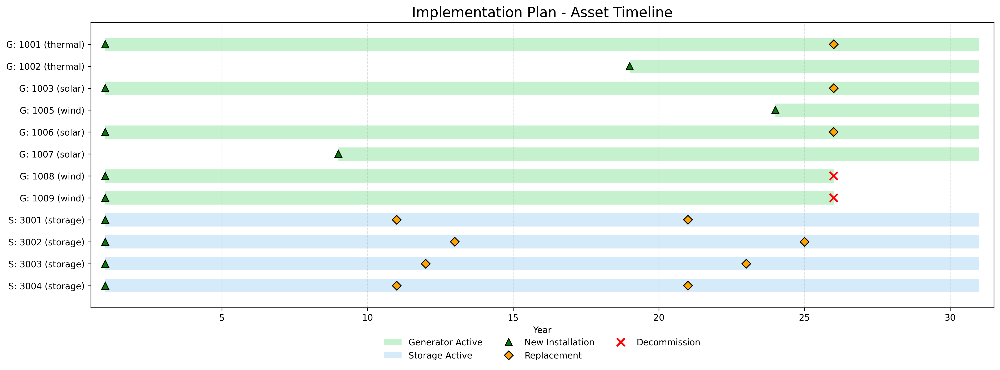
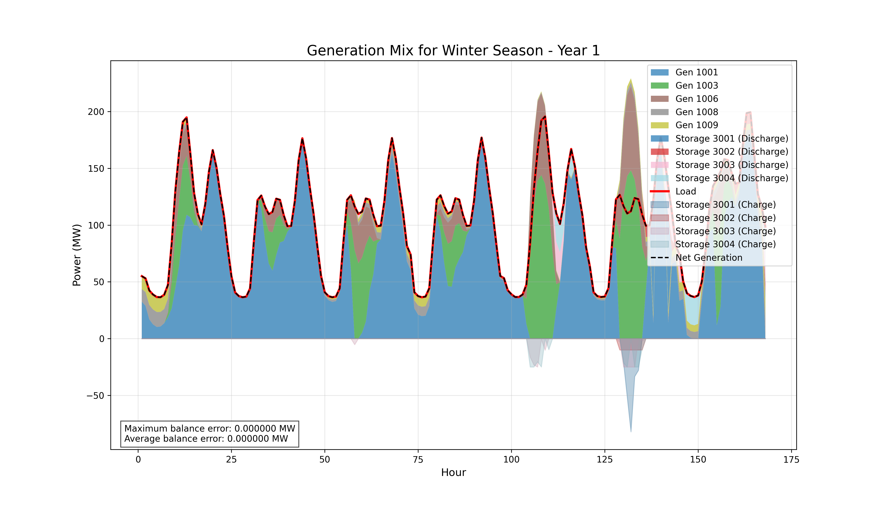
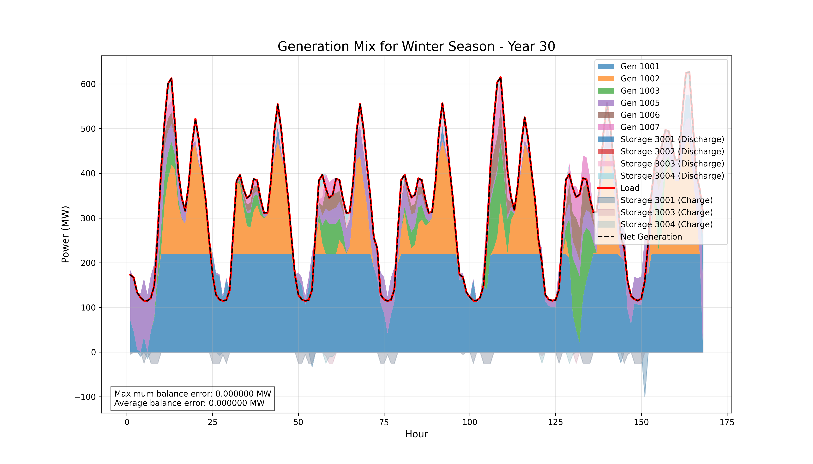
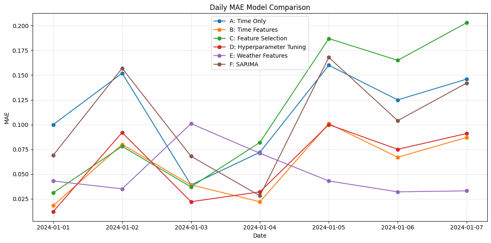

# Investment Model for Energy Assets
_Power-flow MILP optimization, lifetime-cycle planning and photovoltaic forecasting module_


This repo is an investment and long-term energy infrastructure planning. It helps determine which assets to build, when to build them, and for how long they should operate. It uses mixed-integer linear programming (MILP), which allows both the allocation of electricity demand/supply on a grid and the selection of the most suitable assets considering their lifetimes ; all while minimizing the total system cost over multiple years.

Out of personal interest, I also developed a forecasting module for photovoltaic generation using the supervised machine learning algorithm XGBoost. I aimed to analyze how feature engineering improves model performance and compared the results with traditional time-series forecasting models such as (S)ARIMA. Robust testing and secondary implementations are not yet completed.

This project is the direct continuation of my [first-semester project](https://github.com/vierui/vt1-energy-investment-model), expanding from single-year and scenario-based analysis to detailed multi-period, lifecycle-aware decision-making, with a focus on computational efficiency.

## MOTIVATION
Energy system investment planning is complex. Traditional scenario-based methods require manual case definition, cannot capture asset lifecycles, and often miss better solutions hidden in the combinatorial space.

This milp-investment model addresses these challenges by:
- Replacing scenario-by-scenario analysis with direct global optimization over all possible asset mixes and schedules.
- Explicitly tracking asset lifecycles and retirement.
- Allowing the model to automatically select and dispatch the most cost-effective assets from the full candidate pool.
- Efficiently solving large, multi-year planning problems with vectorized constraint formulation.
- Supporting dynamic system needs with integrated load growth and renewable forecasting modules.

## FEATURES
### MILP Optimization
- Multi-year investment planning: Optimizes asset commissioning, operation, and retirement across the full planning horizon.
- Automatic asset selection: Chooses the optimal mix and timing from all available candidates.
- Vectorized constraint formulation: Efficiently builds large optimization problems for scalable computational needs.
- Annualized cost modeling: Accurately reflects capital and operating costs year by year.
- Dynamic demand simulation: Updates asset decisions as projected load evolves.
- Asset lifecycle management: Tracks asset status for installation, operation, and retirement within the model.

### Forecasting
- Integrated PV forecasting module: Uses machine learning (XGBoost + weather data) for short-term solar generation predictions.
- Feature engineering: Incorporates time, lag, and weather-based predictors for improved forecast accuracy.
- Scenario-ready outputs: Enables robust planning by quantifying renewable uncertainty and its operational impacts.

## GETTING STARTED
### Requirements
- **Python**: 3.10 or later
- **Package Manager**: Poetry (pip install poetry)
- **Solver**: IBM CPLEX Studio 22.1+ ([IBM Academic License](https://www.ibm.com/academic))

*Note*: CPLEX path in pyproject.toml must match your installation location

### Install
```
git clone https://github.com/vierui/vt2-investment-milp-forecasting.git
cd investment-milp-forecasting
poetry install
poetry shell
```
### Run a sample scenario
```
python scripts/main.py --grid-file data/grid --profiles-dir data/processed --output-dir results/milp
```
_Default: 30-year horizon, M4 MacBook Pro < 10 min_

### Run PV forecasting (optional)
```
python notebooks/E-weatherfeatures.py
```

## EXAMPLE OUTPUTS AND RESULTS
### Figure 1: Multi-Year Asset Timeline


**Interpretation**:
- Shows when each asset is commissioned, operational, and during the configured horizon
- The model handles growing demand and 'smartly' pick choses to build alternatives assets to mitigates costs

---

### Figure 2: Generation Mix Evolution (Winter Season)

| Year 1 | Year 30 |
|--------|---------|
|  |  |

**Interpretation**:
- Stacked area charts show hourly dispatch patterns over representative winter week
- Demonstrates how the optimizer balances capacity expansion with load growth
- Demonstrates assets limitations and need for diversification and additional ressources

---

### Figure 3: Forecasting Performance (Daily MAE)


**Interpretation**:
- Shows mean absolute error (MAE) for day-ahead PV forecasting across multiple days
- Demonstrates model accuracy degradation over extended forecast horizons
- Lower MAE values indicate better forecast performance

## HOW IT WORKS 
- Inputs:
   - Grid and asset data (CSV/json)
   - Load growth, seasonal profiles (processed via clustering)
- Optimization:
   - Formulated in vectorized MILP (CPLEX via CVXPY)
   - Binary variables track builds and operational status per asset, per year
   - Cost function annualized for fair asset comparison
- Lifecycle Logic:
   - Assets installed for finite lifetimes; model handles retirement/replacement
   - Demand evolution triggers re-optimization of the mix and timing
- Forecasting:
   - PV generation pipeline (optional) uses time, lagged, and weather features; supports rapid model experimentation

## FUTUR WORK 
- Experiment with alternative forecasting models or physical features 
- Robust model testing for ML forecasting
- Scale to larger grids—see results section for benchmarks

## ACKNOWLEDGEMENTS
Built as part of a master’s project at ZHAW School of Engineering.

For technical details and methods, see the project report in report/main.pdf. Questions or feedback welcome. Feel free to reach out or open an issue!

**License**: Academic use only. Please cite appropriately if this work supports your research.